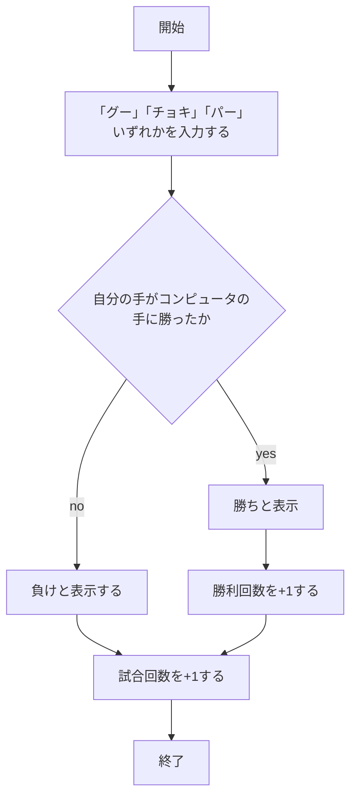
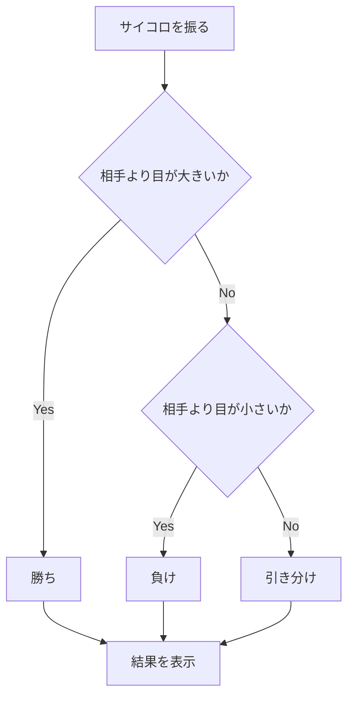
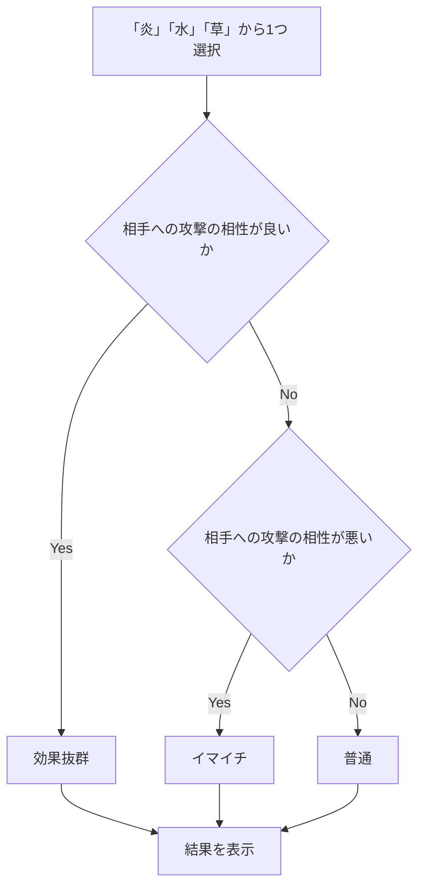

# webpro_06

## プログラム概要

今回作成したプログラムは，使用者が入力した情報をサーバー側がそれに応じて，正誤を記録し結果を表示するプログラムである．

- **じゃんけん**: グー，チョキ，パーのいずれかを入力し，コンピュータが出した手と比べて，勝ち負けを判定するゲームです．
- **サイコロゲーム**: 自分と相手がサイコロを振り，大きい目を出した方が勝ちとなるゲームです．
- **ポ◯モンバトル**: 自分と相手が「炎」「水」「草」から攻撃を選択し、バトルの結果を表示する。

## ファイル一覧

ファイル名 | 説明
-|-
app5.js | プログラム本体
janken.ejs | じゃんけんの結果表示画面
views/dice.ejs | サイコロ結果表示画面
views/battle.ejs | 相性バトル結果表示画面
public/janken.html | じゃんけんの開始画面
public/dice.html | サイコロゲームの開始画面
public/battle.html | 相性バトルゲームの開始画面

## 機能

### じゃんけんの機能

1. じゃんけんのページにアクセスし起動する．
1. 「グー」「チョキ」「パー」いずれかを入力し，送信ボタンを押す．
1. 自分の入力した手とコンピュータが出した手が表示され，勝ったか負けたかを判定する．
1. 現在の試合回数，勝利回数を表示する．
1. 2〜4を繰り返す．




### サイコロゲームの機能

1. サイコロゲームのページにアクセスし，起動する．
1. 「ゲーム開始」ボタンを押してサイコロを振る．
1. 自分のサイコロの目とコンピュータが出したサイコロの目が表示される．
1. ２つの目の数を比べ，サイコロの目が大きいか小さいか同じかを判別し，表示する．
1. 「もう一度遊ぶ」を押し，2〜4を繰り返す．




### ポ◯モンバトルの機能

1. ポ◯モンバトルのページにアクセスし，起動する．
1. 選択肢の「炎」「水」「草」から1つ選び，「バトル開始」のボタンを押す．
1. 自分の選択した技の種類とコンピュータの出した技の種類が表示される．
1. 2つの技の種類を比べ，相性抜群かイマイチか普通かを判別し，表示する．
1. 「もう一度戦う」を押し，2〜4を繰り返す．




## 起動方法

##　じゃんけんの起動方法

1. ターミナルを開きwebpro_06に移動する．
```
cd webpro_06
```
2. app5.jsにコードを入力する．
1. ターミナルで以下のコードを打ち，サーバーを起動する．
```
node app5.js
```
4. その結果，以下のメッセージが返される．
```
Example app listening on port 8080!
```
5. ブラウザで以下のURLにアクセスする．
```
http://localhost:8080/public/janken.html
```
6. 「グー」「チョキ」「パー」のいずれかの文字を入力する．

##　サイコロゲームの起動方法

1. ターミナルを開きwebpro_06に移動する．
```
cd webpro_06
```
2. app5.jsにコードを入力する．
1. ターミナルで以下のコードを打ち，サーバーを起動する．
```
node app5.js
```
4. その結果，以下のメッセージが返される．
```
Example app listening on port 8080!
```
5. ブラウザで以下のURLにアクセスする．
```
http://localhost:8080/public/dice.html
```
6. 「ゲーム開始」ボタンを押す．

##　ポ◯モンバトルの起動方法

1. ターミナルを開きwebpro_06に移動する．
```
cd webpro_06
```
2. app5.jsにコードを入力する．
1. ターミナルで以下のコードを打ち，サーバーを起動する．
```
node app5.js
```
4. その結果，以下のメッセージが返される．
```
Example app listening on port 8080!
```
5. ブラウザで以下のURLにアクセスする．
```
http://localhost:8080/public/battle.html
```
6. 選択肢の欄から「炎」「水」「草」の中から1つを選び，「ゲーム開始」ボタンを押す．