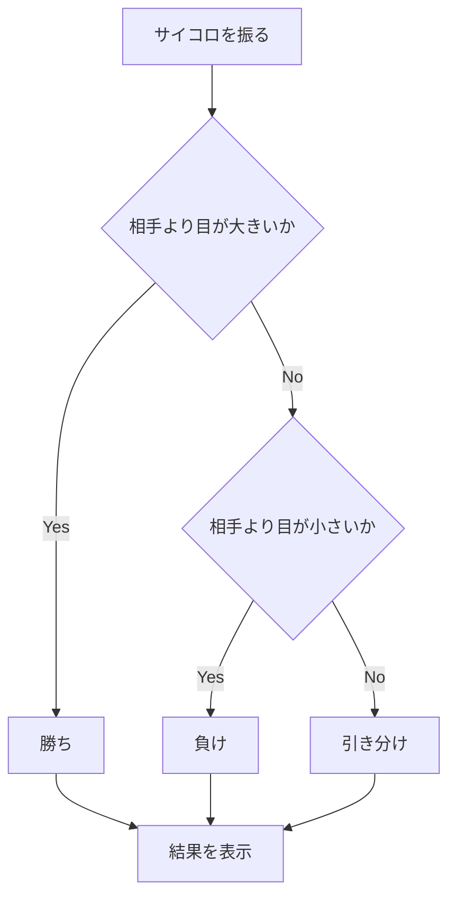
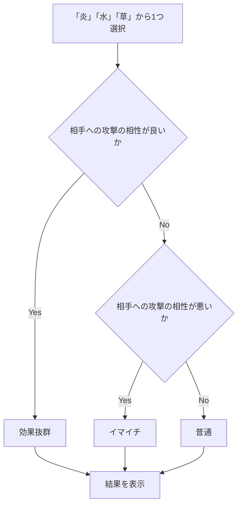

# webpro_06

## プログラム概要

- **サイコロゲーム**: 自分と相手がサイコロを振り、大きい目を出した方が勝ちとなるゲームです。
- **ポ◯モンバトル**: 自分と相手が「炎」「水」「草」から攻撃を選択し、バトルの結果を表示します。

## ファイル一覧

ファイル名 | 説明
-|-
app5.js | プログラム本体
views/dice.ejs | サイコロ結果表示画面
views/battle.ejs | 相性バトル結果表示画面
public/dice.html | サイコロゲームの開始画面
public/battle.html | 相性バトルゲームの開始画面

## サイコロゲームの機能

1. サイコロゲームのページにアクセスします
1. 「ゲーム開始」ボタンを押してサイコロを振ります
1. 自分と相手のサイコロの目と勝敗が表示されます




## ポ◯モンバトルの機能

1. ポ◯モンバトルのページにアクセスする
1. 「炎」「水」「草」から1つ選択しバトルを開始する
1. 相手の選択と結果が表示される





## 起動方法

1. ターミナルを開きwebpro_06に移動します
```
cd webpro_06
```
2. サーバーを起動します
```
node app5.js
```
3. ブラウザで以下のURLにアクセスします
```
http://localhost:8080/public/dice.html
http://localhost:8080/public/battle.html
```
